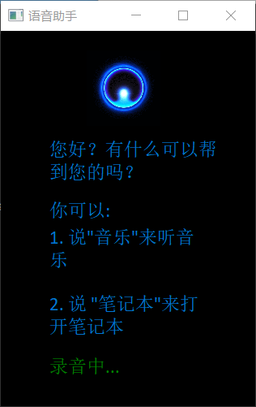
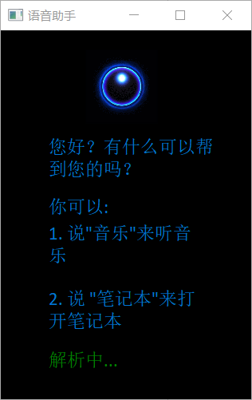
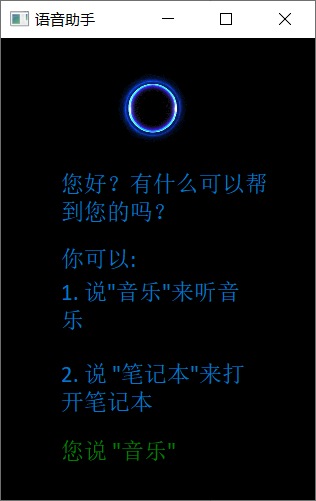
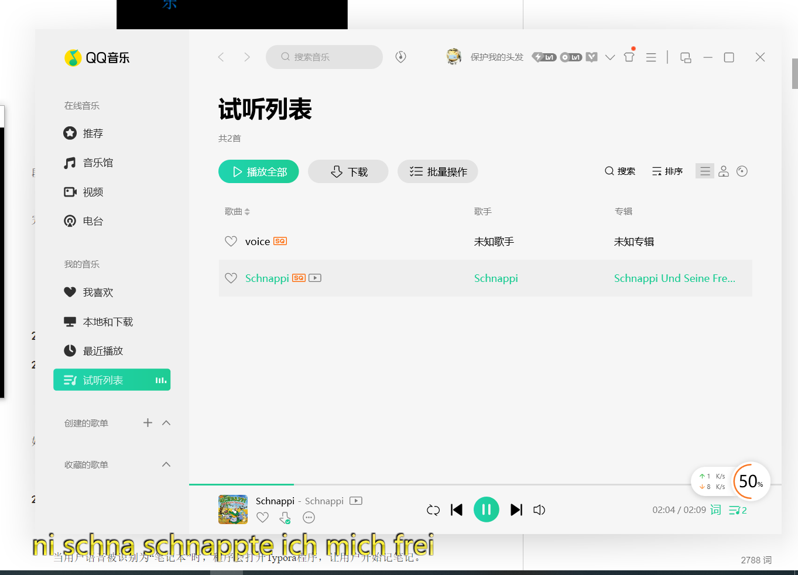
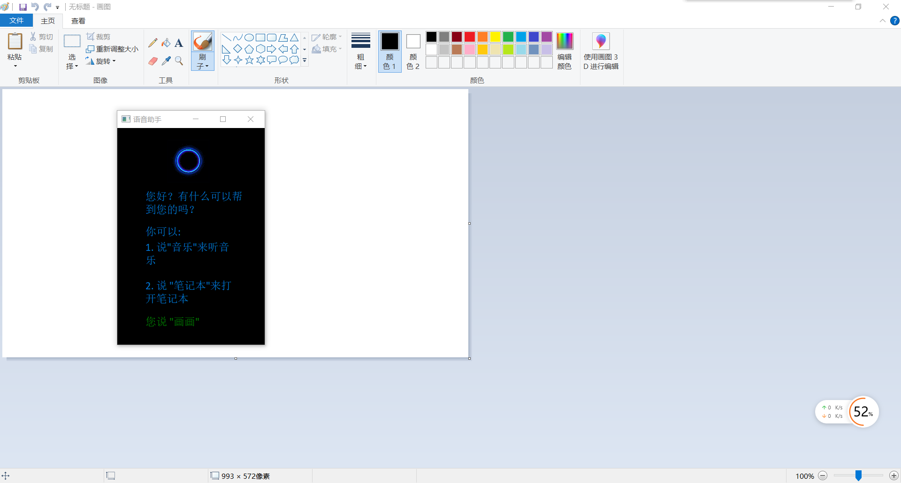
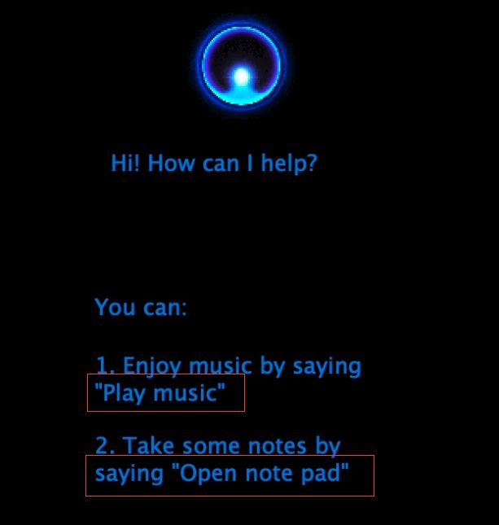

# lab-01

[TOC]


## 项目介绍

​		本项目为语音助手，基于科大讯飞语音识别api以及pyaudio库，利用Qt实现图形用户界面。程序可以让PC用户在使用电脑时，通过语音的方式向计算机下达常用指令并正常执行。


## 项目运行

### 项目启动

​	在ide环境下运行asr.py文件，或者在命令行窗口下，进入asr.py所在目录后，运行指令：python asr.py​


### 录音



​		当最下方的绿色显示为“录音中...”时，用户方可下达语音指令，用户在其他时间段下命令都将被判为无效指令。

​		录音的过程持续3秒左右，用户应避免下达过长指令而造成的话语被截取、语义不完整。

​		当用户录音完成但是没有完成录音解析时，最下方的绿色会显示为“解析中...”。




### 功能执行

#### 音乐功能



效果为：



​		当用户语音被识别为“音乐”时，程序会打开默认路径下的音乐"Schnappi.mp3"，开始播放。


#### 笔记本功能


​		当用户语音被识别为“笔记本”时，程序会打开Typora程序，让用户开始记笔记。但是由于每个PC端的Typora存储位置不一定一致。所以在用户使用此功能前最好先去asrFunction.py的第14行更改文件路径。


#### 画画



​		当用户语音被识别为“画画”时，程序会打开windows默认路径下的画图程序"mspaint.exe"，让用户开始画画。


#### 关闭

​		当用户语音被识别为“关闭”时，程序会关闭自生，结束运行。


## 程序更改

### GUI更改

#### 调整了label的大小

​		在原来的GUI编辑中，原本的label大小不是那么合理，观察下图。



​		观察红框发现"Play"中的'y'、"Open"中的'p'等字母存在下方一小部分被截断的情况。为此，我将label的大小统一调大了一些。 


#### 增加函数setFont(self, typeface, fontSize)

​		考虑到Ui_MainWindow类中设置字体的操作使用次数多、代码繁复且重复度高。因此，我设计了一个函数setFont来简化设置字体操作。

相关代码：

```python
    def setFont(self, typeface, fontSize) -> QtGui.QFont():
        font = QtGui.QFont()
        font.setFamily(typeface)
        font.setPointSize(fontSize)
        return font
```


#### 新增了一个label（$label\_sayWhat$）用于记录软件状态

​		本项目中，一个十分重要的时间就是对于程序状态的展示。本项目一共有三种状态：1，录音状态（label显示“录音中...”），只有在此状态才能进行录音；2，分析录音状态（label显示“解析中...”）；3，程序睡眠状态（label中显示用户上一次说的话），此状态的作用就是用来展示 在语音识别处理后用户的话语。

相关代码：


```python
class Ui_MainWindow(object):
    def setupUi(self, MainWindow):
        #same code

        self.label_sayWhat = QtWidgets.QLabel(self.centralwidget)
        self.label_sayWhat.setGeometry(QtCore.QRect(60, 400, 201, 26))
        font = self.setFont("Calibri", 14)
        self.label_sayWhat.setFont(font)
        self.label_sayWhat.setStyleSheet("color: green;")
        self.label_sayWhat.setWordWrap(True)
        self.label_sayWhat.setObjectName("label_sayWhat")
        # same code

    def updateSayWhat(self, say):
        self.updateBar("")
        _translate = QtCore.QCoreApplication.translate
        self.label_sayWhat.setText(_translate("MainWindow", say))

```

#### GUI语言调整为中文

​		我将交互系统中的所有英文改为中文。例如“Play Music”变为“音乐”。


### 代码更改

#### 新增文件asrFunction.py

​		这个文件的作用为实现程序的功能。其中playMusic函数为打开一个.mp3文件，openNotepad函数为打开软件Typora，drawPicture函数为打开windows自带的画图功能mspaint.exe。


相关代码：

```python
class asrFunction:
    def __init__(self):
        pass

    def playMusic(self, filename):
        filename = filename + ".mp3"
        win32api.ShellExecute(0, 'open', filename, '', '', 1)


    def openNotepad(self):
        win32api.ShellExecute(0, 'open', 'C:\\Program Files\\Typora\\Typora.exe', '', '', 0)


    def drawPicture(self):
        win32api.ShellExecute(0, 'open', 'C:\\WINDOWS\\system32\\mspaint.exe', '', '', 1)

```

#### 新增文件saveVoice.py

​		该文件用于存储用户所说的话。GenAudio中的init函数为初始画化各个参数，save_wav(self, filename)为把语音存于名字为filename的文件中，read_audio(self)为打开麦克风开始录入语音。函数saveVoice()描述了用户从麦克风录入数据到存储数据的整个操作流程。


相关代码：

```python
class GenAudio(object):
    def __init__(self):
        self.num_samples = 2000  # pyaudio内置缓冲大小
        self.sampling_rate = 8000  # 取样频率
        self.level = 1500  # 声音保存的阈值
        self.count_num = 20  # count_num个取样之内出现COUNT_NUM个大于LEVEL的取样则记录声音
        self.save_length = 8  # 声音记录的最小长度：save_length * num_samples 个取样
        self.time_count = 1000  # 录音时间，单位s
        self.voice_string = []

    # 保存文件
    def save_wav(self, filename):
        wf = wave.open(filename, 'wb')
        wf.setnchannels(1)
        wf.setsampwidth(2)
        wf.setframerate(self.sampling_rate)
        wf.writeframes(np.array(self.voice_string).tobytes())
        wf.close()

    def read_audio(self):
        pa = PyAudio()
        stream = pa.open(format=paInt16, channels=1, rate=self.sampling_rate, input=True,
                         frames_per_buffer=self.num_samples)

        save_count = 0
        save_buffer = []
        time_count = self.time_count

        while True:
            time_count -= 1

            # 读入num_samples个取样
            string_audio_data = stream.read(self.num_samples)
            # 将读入的数据转换为数组
            audio_data = np.frombuffer(string_audio_data, dtype=np.short)
            # 计算大于 level 的取样的个数
            large_sample_count = np.sum(audio_data > self.level)

            print(np.max(audio_data)), "large_sample_count=>", large_sample_count

            # 如果个数大于COUNT_NUM，则至少保存SAVE_LENGTH个块
            if large_sample_count > self.count_num:
                save_count = self.save_length
            else:
                save_count -= 1
            if save_count < 0:
                save_count = 0

            if save_count > 0:
                save_buffer.append(string_audio_data)
            else:
                if len(save_buffer) > 0:
                    self.voice_string = save_buffer
                    save_buffer = []
                    print("Recode a piece of  voice successfully!")
                    return True

            if time_count == 0:
                if len(save_buffer) > 0:
                    self.voice_string = save_buffer
                    save_buffer = []
                    print("Recode a piece of  voice successfully!")
                    return True
                else:
                    return False
        return True


def saveVoice():
    r = GenAudio()
    r.read_audio()
    if os.path.exists("voice.wav"):  # 如果文件存在
        # 删除文件，可使用以下两种方法。
        os.remove("voice.wav")
        time.sleep(1)
    r.save_wav("voice.wav")
```


#### 新增文件voiceApi.py

​		该文件调用科大讯飞的语音识别api对语音用户语音进行解析。其中distinguish函数中顺序执行了url生成、连接建立、语音解析、返回结果等多个过程。为本项目语音识别中的非常关键的函数。

相关代码：

```python
# -*- coding:utf-8 -*-
import websocket
import datetime
import hashlib
import base64
import hmac
import json
from urllib.parse import urlencode
import time
import ssl
from wsgiref.handlers import format_date_time
from datetime import datetime
from time import mktime
import _thread as thread

STATUS_FIRST_FRAME = 0  # 第一帧的标识
STATUS_CONTINUE_FRAME = 1  # 中间帧标识
STATUS_LAST_FRAME = 2  # 最后一帧的标识


class Ws_Param(object):
    # 初始化
    def __init__(self, APPID, APIKey, APISecret, AudioFile):
        self.APPID = APPID
        self.APIKey = APIKey
        self.APISecret = APISecret
        self.AudioFile = AudioFile

        # 公共参数(common)
        self.CommonArgs = {"app_id": self.APPID}
        # 业务参数(business)，更多个性化参数可在官网查看
        self.BusinessArgs = {"domain": "iat", "language": "zh_cn", "accent": "mandarin", "vinfo": 1, "vad_eos": 10000}

    # 生成url
    def create_url(self):
        url = 'wss://ws-api.xfyun.cn/v2/iat'
        # 生成RFC1123格式的时间戳
        now = datetime.now()
        date = format_date_time(mktime(now.timetuple()))

        # 拼接字符串
        signature_origin = "host: " + "ws-api.xfyun.cn" + "\n"
        signature_origin += "date: " + date + "\n"
        signature_origin += "GET " + "/v2/iat " + "HTTP/1.1"
        # 进行hmac-sha256进行加密
        signature_sha = hmac.new(self.APISecret.encode('utf-8'), signature_origin.encode('utf-8'),
                                 digestmod=hashlib.sha256).digest()
        signature_sha = base64.b64encode(signature_sha).decode(encoding='utf-8')

        authorization_origin = "api_key=\"%s\", algorithm=\"%s\", headers=\"%s\", signature=\"%s\"" % (
            self.APIKey, "hmac-sha256", "host date request-line", signature_sha)
        authorization = base64.b64encode(authorization_origin.encode('utf-8')).decode(encoding='utf-8')
        # 将请求的鉴权参数组合为字典
        v = {
            "authorization": authorization,
            "date": date,
            "host": "ws-api.xfyun.cn",
        }
        # 拼接鉴权参数，生成url
        url = url + '?' + urlencode(v)
        # print("date: ",date)
        # print("v: ",v)
        # 此处打印出建立连接时候的url,参考本demo的时候可取消上方打印的注释，比对相同参数时生成的url与自己代码生成的url是否一致
        # print('websocket url :', url)
        return url


ans = ""


# 收到websocket消息的处理
def on_message(ws, message):
    try:
        code = json.loads(message)["code"]
        sid = json.loads(message)["sid"]
        if code != 0:
            errMsg = json.loads(message)["message"]
            print("sid:%s call error:%s code is:%s" % (sid, errMsg, code))

        else:
            data = json.loads(message)["data"]["result"]["ws"]
            # print(json.loads(message))
            result = ""
            for i in data:
                for w in i["cw"]:
                    result += w["w"]
            print("sid:%s call success!,data is:%s" % (sid, data))
            global ans
            if ans == "" and len(result) > 1:
                ans = result

    except Exception as e:
        print("receive msg,but parse exception:", e)


# 收到websocket错误的处理
def on_error(ws, error):
    print("### error:", error)


# 收到websocket关闭的处理
def on_close(ws):
    print("### closed ###")


# 收到websocket连接建立的处理
def on_open(ws):
    def run(*args):
        frameSize = 8000  # 每一帧的音频大小
        intervel = 0.04  # 发送音频间隔(单位:s)
        status = STATUS_FIRST_FRAME  # 音频的状态信息，标识音频是第一帧，还是中间帧、最后一帧

        with open(wsParam.AudioFile, "rb") as fp:
            while True:
                buf = fp.read(frameSize)
                # 文件结束
                if not buf:
                    status = STATUS_LAST_FRAME
                # 第一帧处理
                # 发送第一帧音频，带business 参数
                # appid 必须带上，只需第一帧发送
                if status == STATUS_FIRST_FRAME:

                    d = {"common": wsParam.CommonArgs,
                         "business": wsParam.BusinessArgs,
                         "data": {"status": 0, "format": "audio/L16;rate=16000",
                                  "audio": str(base64.b64encode(buf), 'utf-8'),
                                  "encoding": "raw"}}
                    d = json.dumps(d)
                    ws.send(d)
                    status = STATUS_CONTINUE_FRAME
                # 中间帧处理
                elif status == STATUS_CONTINUE_FRAME:
                    d = {"data": {"status": 1, "format": "audio/L16;rate=16000",
                                  "audio": str(base64.b64encode(buf), 'utf-8'),
                                  "encoding": "raw"}}
                    ws.send(json.dumps(d))
                # 最后一帧处理
                elif status == STATUS_LAST_FRAME:
                    d = {"data": {"status": 2, "format": "audio/L16;rate=16000",
                                  "audio": str(base64.b64encode(buf), 'utf-8'),
                                  "encoding": "raw"}}
                    ws.send(json.dumps(d))
                    time.sleep(1)
                    break
                # 模拟音频采样间隔
                time.sleep(intervel)
        ws.close()

    thread.start_new_thread(run, ())


wsParam = Ws_Param(APPID='bca06165', APISecret='OWEzZDAxYjUwZDk5ZTUxMGM4OTk1YmQ3',
                   APIKey='9ddd1ec3770da8dd863e2a39eb911988',
                   AudioFile=r'voice.wav')


def distinguish():
    # 测试时候在此处正确填写相关信息即可运行
    time1 = datetime.now()
    websocket.enableTrace(False)
    global ans
    ans = ""
    wsUrl = wsParam.create_url()
    ws = websocket.WebSocketApp(wsUrl, on_message=on_message, on_error=on_error, on_close=on_close)
    ws.on_open = on_open
    ws.run_forever(sslopt={"cert_reqs": ssl.CERT_NONE})
    time2 = datetime.now()
    print(time2 - time1)
    ans = ans.strip()
    return ans

```

#### asr.py文件中新增类Runthread(QtCore.QThread)

​		定义了一个Qt的线程，用于运行程序的语音交互部分，防止程序的ui部分与语音识别部分相互干扰。

相关代码：

```python
class Runthread(QtCore.QThread):
    _signal = pyqtSignal(str)

    def __init__(self, mywindow):
        super(Runthread, self).__init__()
        self.mw = mywindow

    def __del__(self):
        self.wait()

    def run(self):
        speech_interaction(self.mw)
```


#### asr.py文件中新增函数speech_interaction(mywindow)

​			该函数为用户与系统在语音交互过程中最主要的函数。在该函数中，会完成对于用户语音的读取、解析、以及匹配系统的功能。

相关代码：

```python
def speech_interaction(mywindow):
    # obtain audio from the microphone
    # 从麦克风记录数据
    while True:
        mywindow.ui.updateSayWhat("录音中...")
        saveVoice()
        mywindow.ui.updateSayWhat("解析中...")
        voice = distinguish()
        print("You said: {}".format(voice))
        if voice is None:
            mywindow.ui.updateSayWhat("解析失败")
            continue

        if voice == "" or len(voice) < 1:
            mywindow.ui.updateSayWhat("您没说话")
            time.sleep(5)
            continue

        func = asrFunction()

        if voice == "音乐":
            mywindow.ui.updateSayWhat("您说 \"音乐\"")
            func.playMusic("Schnappi")

        elif voice == "笔记本":
            mywindow.ui.updateSayWhat("您说 \"笔记本\"")
            func.openNotepad()
        elif voice == "画画":
            mywindow.ui.updateSayWhat("您说 \"画画\"")
            func.drawPicture()
        elif voice == "关闭":
            mywindow.ui.updateSayWhat("您说 \"关闭\"")
            time.sleep(5)
            sys.exit(app.exec())
        else:
            mywindow.ui.updateSayWhat("您说了 \"" + voice + "\"")
            mywindow.ui.updateBar("我们没有这个功能")
        time.sleep(5)

```

## 提高识别准确度的尝试

### 基于guessTheWord.py的尝试

​		在最开始，我对老师提供的guessTheWord.py中的recognize_speech_from_mic(recognizer, microphone)函数进行调试与测验。但经过了多次测试后发现该函数语音识别准确率极差，几乎无法成功解析用户（我）所说的任何信息。


### 更换api

​		考虑到speech_recognition库的识别准确率不是很理想，我换了一个新的api（科大讯飞语音识别api）进行尝试。但是可能是因为我英语口语的关系，我的语音除了“Hello”、“Apple”等极度简单的词汇，其他的依旧很难识别出来。


### 更换为中文识别

​		为了避免自己的英语口语对语音识别造成不良影响，我把程序界面、输入语音、语音校对等等都换成了中文。在更换过后，识别准确率优了明显的提升，几乎不会出现识别错误的情况。